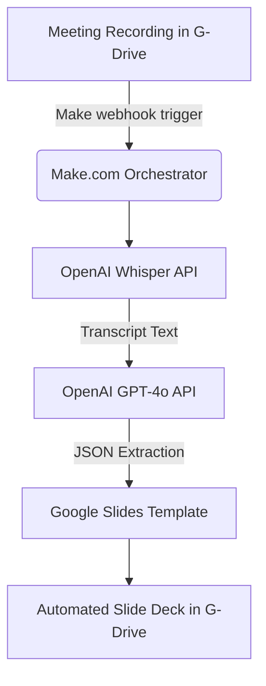

# AI Automation Test: Meeting Summarizer

This repository contains my solution for the AI Engineer technical test. The goal was to build an automated workflow that ingests a meeting recording and outputs a formatted Google Slides deck with a summary, objectives, action items, and next steps.

## Project Links
- **GitHub Repository**: [Source Code & Documentation](https://github.com/DanielCaro317/Test-Interview)
- **Make.com Public Scenario**: [Integration Template](https://us2.make.com/public/shared-scenario/HFrgB7u0qj6/integration-google-drive-open-ai-chat-gp)
- **Live Google Drive Folder**: [Project Workspace (Inputs & Outputs)](https://drive.google.com/drive/folders/12w8hsFzveTXSqyvvAFbriC-fEcp9rPFi?usp=sharing)
- **Video Explicativo**: Puede encontrar el video paso a paso grabado (2026-04-03 15-36-28.mov) directamente en este repositorio. Debido a su tamaño, ha sido subido mediante Git LFS. Para visualizarlo o descargarlo:
  1. Vaya a la página de inicio del repositorio en GitHub.
  2. Haga clic en el archivo `2026-04-03 15-36-28.mov`.
  3. Haga clic en el botón **Download** (o en el ícono de descarga) para obtener el archivo original.
## Part 1: Solution Architecture

### Core Components
1. **Ingestion**: Google Drive. A specific folder is monitored for new meeting recordings.
2. **Orchestration**: Make.com. Used to wire the APIs together securely and visually, allowing non-technical stakeholders to monitor the workflow efficiently.
3. **AI Inference**: 
   - **OpenAI Whisper API**: For accurate speech-to-text transcription.
   - **OpenAI GPT-4o**: For extracting the required structured data (Summary, Objectives, Tasks, Next Steps) from the raw transcript.
4. **Presentation Output**: Google Slides. Make.com maps the JSON variables extracted by GPT-4o directly into a predefined slide template.

### Data Flow

*(Note: Whisper has a 25MB file size limit. In a production environment with longer meetings, this architecture would naturally be prefixed with a Python microservice to slice the audio into smaller chunks before hitting the API).*

---

## Part 2: Technology Cost Estimate

Here is the estimated monthly cost for processing 20 meetings/month (assuming ~60 minutes per meeting):

| Component | Usage | Estimated Cost |
|-----------|-------|----------------|
| **Make.com** | Core tier (10,000 ops/mo) | $10.59 / mo |
| **OpenAI Whisper** | ~1200 minutes ($0.006/min) | $7.20 / mo |
| **OpenAI GPT-4o** | ~20 API calls + Tokens | ~$0.40 / mo |
| **Total** | | **~$18.19 / month** |

---

## Part 3 & 4: POC and Documentation

### For the Client (Non-Technical)
**What it does:** This workflow completely automates the creation of meeting notes and presentations. 
**How to use it:** Just drop your meeting recording (.mp4, .m4a, or .mp3) into the designated Google Drive folder. After a few minutes, a formatted Google Slide deck containing the key points and action items will appear automatically in the "Outputs" folder. No manual steps are required.

### For the Technical Team
**Setup Instructions:**
1. Clone my Make.com scenario using the provided public link above.
2. Re-authenticate the Google Drive modules and the Google Slides module with the target Google Workspace account.
3. Define the target Google Slides template ID within the Make module.
4. Add the OpenAI API Key in the Make.com connections tab.

**Troubleshooting and Logs:**
If an API limit is reached, Make.com will pause the execution and store the webhook payload. It can be re-run with one click once the limit resets. Visual logging enables easy debugging of nested JSON responses from GPT-4o.
